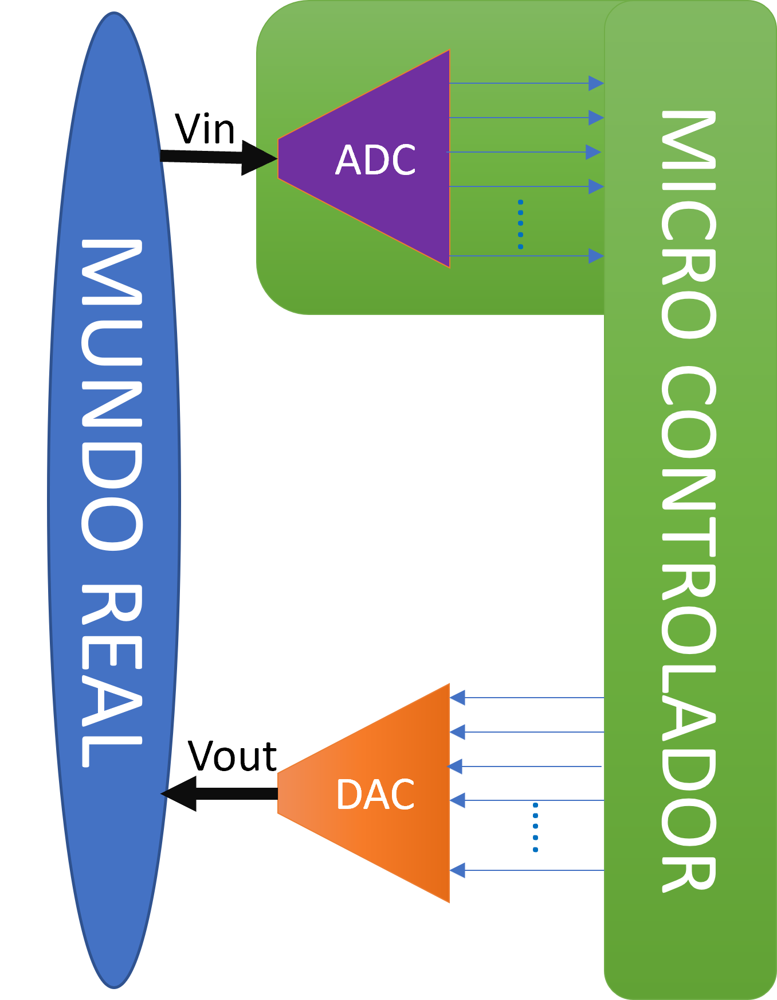
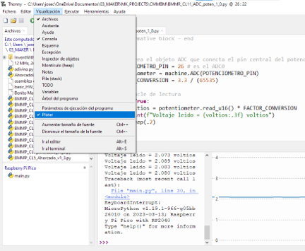

# 2526_CL6_Entradas_Analogicas1er

Clase 6- Entradas Analogicas 1er Estudio

Indice evolutivo del las clases del taller + libros y webs de referencia:

[GitHub - Jcspoza/2526_PyR_Index: Curso Programación y Robotica 2025 2026 - CMM BML](https://github.com/Jcspoza/2526_PyR_Index)

## Clase 6 - Indice

- Propuesta de estudio : entradas analógicas en micro Controladores

- Materiales y links a información
  
  * Lista de materiales
  
  * Links a Tutoriales  e informacion
  - Librerías importantes - No necesarias

- Aprender / Entender: entradas analógicas en micro Controladores
  
  - Intro Teórica breve a los ADC´s
  
  - 1er montaje : Divisor de tensión
  
  - 2do Montaje : Potenciómetro
  
  - 3ro Montaje : LDR

- Lista (no completa) de sensores analógicos en robotica

- Proyecto completo: por decidir

- Tabla resumen de programas

- TO DO y Notas

## Propuesta de estudio : entradas analógicas en micro Controladores

## Materiales y links a información

### Librerías importantes - No necesarias

## Aprender / Entender: entradas analógicas en micro Controladores

### Intro Teórica breve a los ADC´s

El mundo real es analógico, luego si queremos controlarlo con electrónica programable (=microcontroladores), tenemos que poder 'leer' informacion analógica y viceversa, tenemos que poder convertir de vuelta al mundo real, informacion digital en una magnitud física como un voltaje que se corresponda con la informacion digital.

Por eso, no es raro que desde el inicio los micro Controladores tuvieran entradas que podían convertir la informacion analógica, normalmente un valor de voltaje, informacion digital: el controlador Arduino UNO R3 ( lanzado en 2011)  tiene 6 entradas analógicas directas, o ADC´s. La conversión contraria, desde digital a analógico o DAC no es común en los uControladores porque priorizan la funcionalidad básica, el bajo costo y el bajo consumo, y el **ADC es más crítico para la mayoría de las interacciones con el mundo analógico**; además, para aplicaciones de alta fidelidad o velocidad (audio, video), un DAC externo ofrece mejor rendimiento, precisión, flexibilidad y diseño modular. 

El uC PICO W/2W tiene 4 conversores analógico a digital ADC disponibles 

* 3 x en ellos pines 26, 27 y 28  ADC0, ADC1, ADC2

* Y 1 mas que lee la temperatura

#### Conceptos a conocer Conversión Analógico-> Digital

**Muestreo**: complejo, no es importante a baja velocidad 

**Rango de entrada** En el Pico y Pico W : **0 volt a 3.3 volt**

**Resolución** En el Pico y Pico W : **12 bits expandidos a 16bits** La expansión es por expansión de Taylor no una simple multiplicación La resolución = Rango / (2 n -1)= 3.3 volt / (2 16 -1)= **50 uvolt** 

**Off-set** complejo

**Linealidad** complejo

### 1er montaje : Divisor de tensión sin  uControlador

Antes de usar en programación una de las entradas analógicas del Pico w/2w, hay que entender un divisor de tensión construido con 2 resistencias. la teoria basica la podemso encontrar en el libro de electrónica de referencia 

[Electronica para makers - Paoplo Aliverti - Ed marcombo](https://github.com/Jcspoza/2526_PyR_Index/blob/main/doc/edoc.site_electronica-para-makers-paolo-aliverti.pdf)

en la pag 70 '**Divisores de tensión y de corriente'**

o la siguiente guía

[¡Domina el Divisor de Tensión! ⚡️ Aprende a Calcularlo Fácilmente &#8211; Cano Electrónica](https://proveedoracano.com/blog/todo-sobre-el-divisor-de-tension-guia-rapida-principiantes/)

de la que tomare la siguiente imagen y la formula básica del divisor de tensión

Montemos un divisor de tensión con una fuente de 5 volt ( como V in) y 2 resistencias de distintos valores : 220 ohm, 330 ohm y 16 ohm, y comprobemos la formula del Vout en R2

#### Tolerancia de las resistencias

Ya que disponemos de varias resistencias del mismo valor teórico, comprobemos como <u>si medimos varias del mismo valor </u>**NO darán los mismos exactos valores**, pero los valores estaran en el rango de tolerancia: 10%, 5%,...

### 2do Montaje : Potenciómetro

Vamos a hacer una versión simplificada del tutorial de sunfounder ( sin LED controlado por PWM) 

[2.12 Feel the Light &mdash; SunFounder Pico 2 W Starter Kit for Raspberry Pi Pico 2 W documentation](https://docs.sunfounder.com/projects/pico-2w-kit/en/latest/pyproject/py_photoresistor.html)

codigo propio-Potenciometro

#### Truco en Thonny - ploter

En Thonny añado “plotter” a la visualización

### 3ro Montaje : LDR

Seguiremos el montaje de Sunfounder

[2.12 Feel the Light &mdash; SunFounder Pico 2 W Starter Kit for Raspberry Pi Pico 2 W documentation](https://docs.sunfounder.com/projects/pico-2w-kit/en/latest/pyproject/py_photoresistor.html)

codigo propio-LDR

### Lista (no completa) de sensores analógicos en robotica

---

## Proyecto completo: por decidir

## Tabla resumen de programas

## TO DO y Notas
